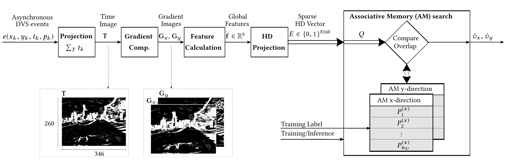
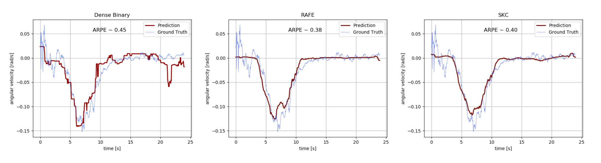

Copyright (C) 2020 ETH Zurich, Switzerland. 
SPDX-License-Identifier: GPL-3.0-only.
See LICENSE file for details.

Author: Edoardo Mello Rella <edoardom@student.ethz.ch>

## Integrating Event-based Dynamic Vision Sensors with Sparse Hyperdimensional Computing

This project provides the experimental environment used to produce the results reported in the paper <em>Integrating Event-based Dynamic Vision Sensors with Sparse Hyperdimensional Computing: A Low-power Accelerator with Online Learning Capability</em>, which will be published at ISLPED'20. If you find this work useful in your research, please cite

```
@inproceedings{dvs_hdsparse,
author = {Hersche, Michael, and Mello Rella, Edoardo and Di Mauro, Alfio and Benini, Luca and Abbas, Rahimi},
title = {Integrating Event-based Dynamic Vision Sensors with Sparse Hyperdimensional Computing: A Low-power Accelerator with Online Learning Capability},
year = {2020},
publisher = {Association for Computing Machinery},
address = {New York, NY, USA},
doi = {10.1145/3370748.3406560},
booktitle = {Proceedings of the International Symposium on Low Power Electronics and Design},
numpages = {6},
keywords = {Sparse HD computing, robotics, event-based cameras, regression},
location = {Boston, MA, USA},
series = {ISLPED ’20}
}
```

# Overview

This project contains Python implementations (`python_implementation`) for velocity regression based on Dynamic Vision Sensors (DVS) using various traditional and novel methods based hyperdimensional (HD) computing. Moreover, the inference of the best performing regressions methods are implementd in C (`c_implementation`) which can be exectuted on [GAP8](https://greenwaves-technologies.com/), a RISC-V based ultra-low power commercial SoC containing an 8-core computational cluster. 

The figure below shows our proposed pipeline, starting from Dynamic Vision Sensors (DVS) sequences to velocity inference.



It first groups the DVS sequence into slices of fixed duration (0.05s).
Then, all the events in the slices are projected to the image plane producing time images and subsequently gradient images with the spatial gradient on the image plane.
A set of 6 global features is extracted from the gradient image and used as input to the regression task to infer velocity.

While the first part of the pipeline is implemented only in Python, the set of methods to get from the features to the predictions is implemented in C too.

This last part of the pipeline is implemented using various methods:
* <b>HD sparse binary vectors with RAFE or SKC mapping function (new)</b>
* HD dense binary vectors
* HD dense integer vectors (only in Python for targeted embedded system memory constraints)
* Multi-layer Perceptron 
* Linear and polynomial regression

Following will be example traces with three different Hyperdimensional methods to qualitatively demonstrate the different performance.



# License and Attribution
Please refer to the LICENSE file for the licensing of our code. The python implementation relies on [pyhdc](https://github.com/ncos/pyhdc) released under GPL v3.0, and part of the C implementation relies on [FANN-on-MCU](https://github.com/pulp-platform/fann-on-mcu) under LGPL v2.1.
